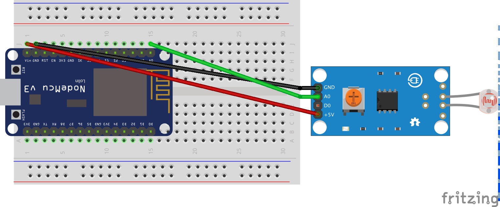

# esp8266-LDR
contoh penggunaan LDR pada esp8266

## Kebutuhan perangkat
Adapun untuk melakukan percobaan ini dibutuhkan beberapa perangkat seperti
+ ESP8266 Amica, boleh lolita
+ Sensor LDR dengan potensio(MH sensor series)
+ Kabel jumper sebanyak 3 buah
+ Breadboard

## Skematik
Untuk design skematik dapat digambarkan di bawah ini

Design dalam format fritzing dapat diambil di [esp8266-ldr.fzz](esp8266-ldr.fzz)

## Koneksi eps8266 dan sensor LDR
Dari gambar di atas dapat dilihat pengkabelan seperti pada tabel di bawah ini

| ESP8266 Amica | Sensor LDR                  |
|---------------|------------------------------------|
| VCC           | VCC                                |
| GND           | GND                                |
| A0            | A0                               |